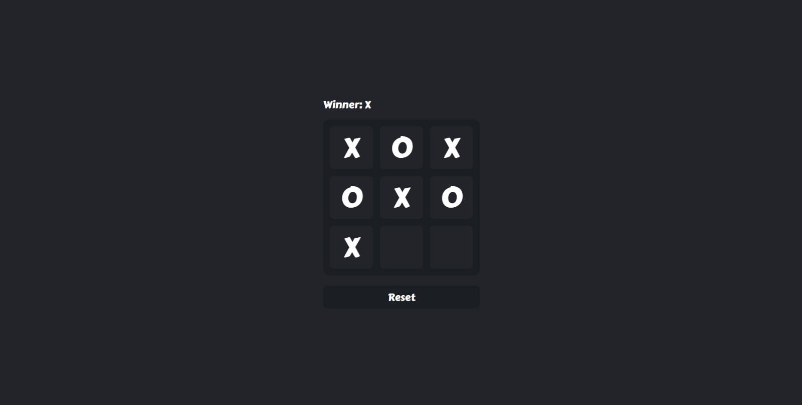

<h1 align="center"> Tic Tac Toe </h1>



A simple and fun Tic Tac Toe game built using **React**, **Vite**, and **Tailwind CSS**.

## Features

-   **Responsive Design:** The game is fully responsive, making it playable on all devices.
-   **Winner Detection:** The game automatically detects a win, draw, or ongoing game.
-   **Clean UI:** Simple and modern design using Tailwind CSS.

## Tech Stack

-   **React**: For building the user interface.
-   **Vite**: For fast and optimized development.
-   **Tailwind CSS**: For styling and responsive design.

## Installation

To get started with this project locally, follow these steps:

1. **Clone the repository:**

    ```bash
    git clone https://github.com/rtrivaldo/Tic-Tac-Toe.git
    ```

2. **Navigate to the project directory:**

    ```bash
    cd Tic-Tac-Toe
    ```

3. **Install dependencies:**
    ```bash
    npm install
    ```
4. **Start the development server:**
    ```bash
    npm run dev
    ```
    The game should now be running on `http://localhost:3000`.

## How to Play

1. Click on an empty square to place your mark (X or O).
2. Alternate turns between players until one wins or the game ends in a draw.

## Contributing

Contributions are welcome! If you find any bugs or have suggestions for improvements, please open an issue or submit a pull request.

## Author

-   [Rivaldo Tandoko](https://github.com/rtrivaldo)
